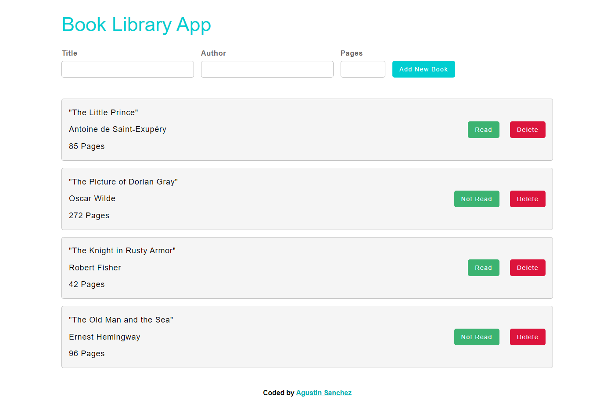
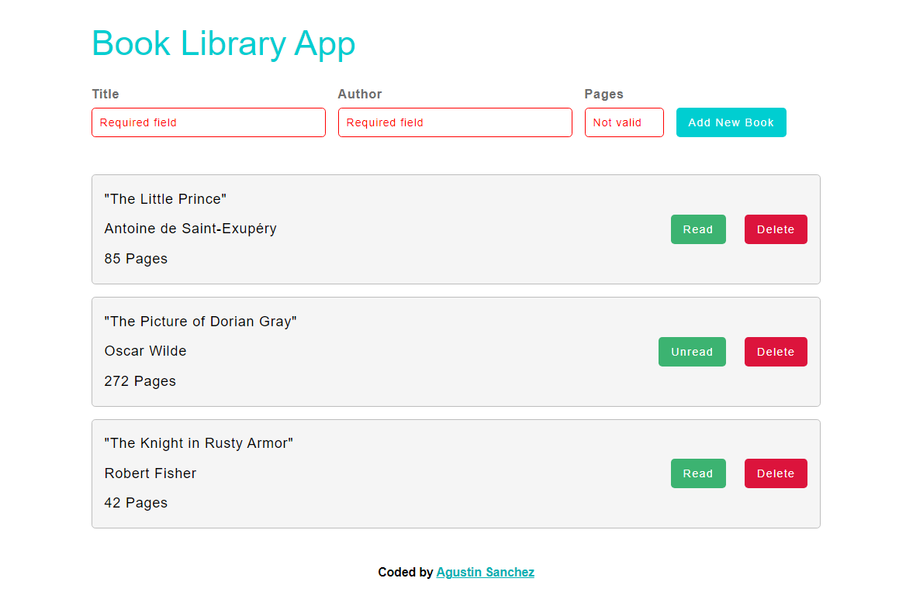
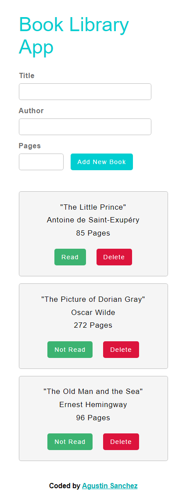

# Book Library App

JavaScript C.R.U.D.(create, read, update, delete) aplication made with local storage.
You can save a list of books, change their status and delete them from the list.

Users should be able to:

- View the optimal layout depending on their device's screen size
- Add book to list
- Change the status of the book
- Delete books

### Screenshots

- Desktop view

- Mobile view

### Link

- [Live site](https://library-app-js.vercel.app/)

### Built with

 
 
  
 

- Semantic HTML5 markup
- CSS custom properties
- Flexbox
- Sass
- Media queries and responsive design
- Form validations
- Local storage
- JavaScript classes

## Author

- Linkedin - [Agustin Emanuel Sanchez](https://www.linkedin.com/in/agustin-emanuel-sanchez-4b2807240/)
- Frontend Mentor - [@agusscript](https://www.frontendmentor.io/profile/agusscript)
- CodePen - [Agustin Sanchez](https://codepen.io/agusscript)
- Twitter - [@agus_script](https://twitter.com/agus_script)
